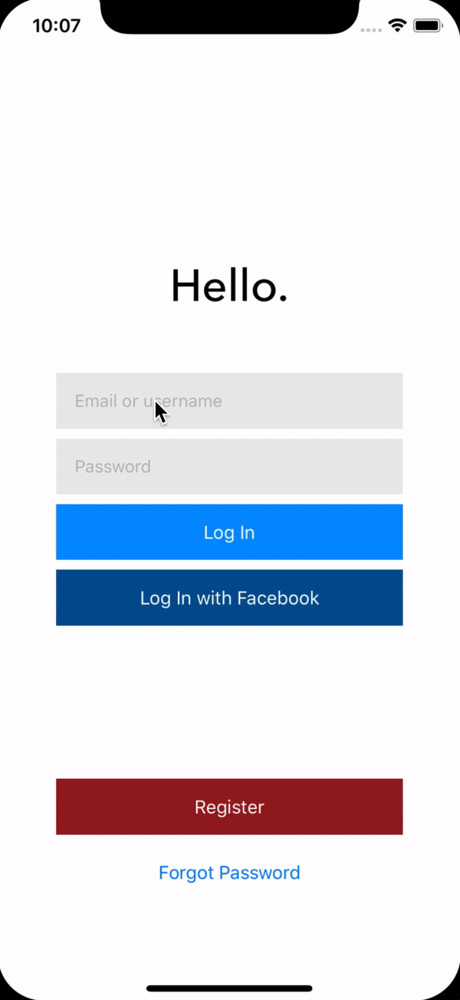

# Messenger-iOS

A simple messenger application

Currently implemented
- Registering and login authentication using Firebase
- Persist user data into firebase db
- UI for contacts page with custom table view layout
- Add contacts by email and persist into firebase db
- Accept or decline contact requests

To do
- Open contact profile 
- Send instant text messages to contacts
- Profile settings page (Profile picture, username, sign out etc.)
- Stay logged in on device
- Push notifications (contact request, message recieved) 

Icons: https://www.flaticon.com/packs/profession-avatars
